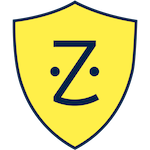

# ZocSec.SecurityAsCode.AWS

Welcome to the Zocdoc Information Security Team (ZocSec) SecurityAsCode repository for AWS.  Part of the ZocSec mandate is to use AWS's in-built technologies to automate the remediation of common security problems.   In this repository, ZocSec presents code & configuration used to lock down our AWS environment.  

# Project List

These are the projects we're currently ready share:

* [S3 Bucket Automated Encryption](S3-auto-encrypt/) - This AWS module will automatically encrypt S3 buckets that become unencrypted.
* [EC2 Malware Automated Termination](EC2-auto-terminate/) - An automated means to euthanize EC2 instances which have been compromised by malware.
* [Security Group Automated Update](security-group-auto-update/) - A mechanism to automatically correct Security Groups that expose sensitive ports to 0.0.0.0/0.  

We will be sharing more of our projects in the future.

# Contributions

We welcome contributions and pull requests to this repo; give us feedback.

<!-- vim: spell noexpandtab sw=4 sts=4 ts=4
-->
